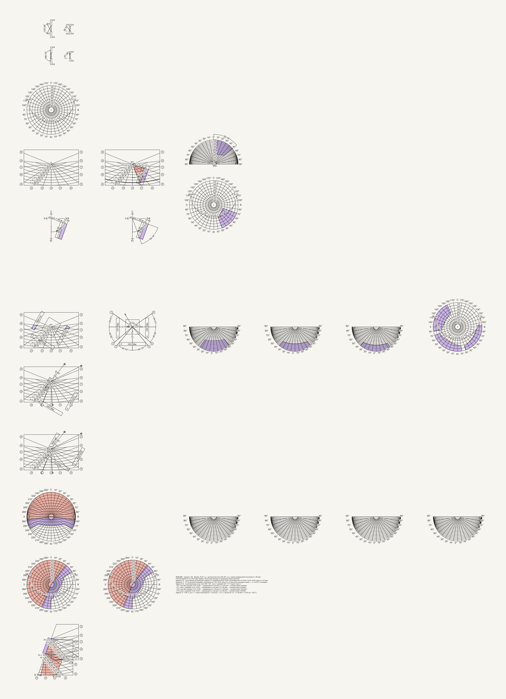
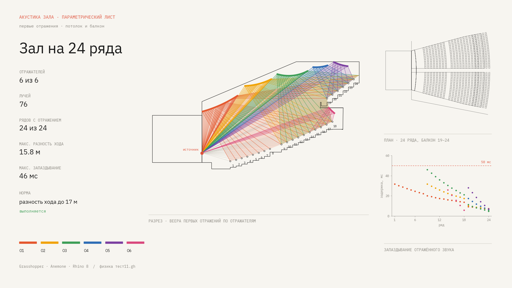
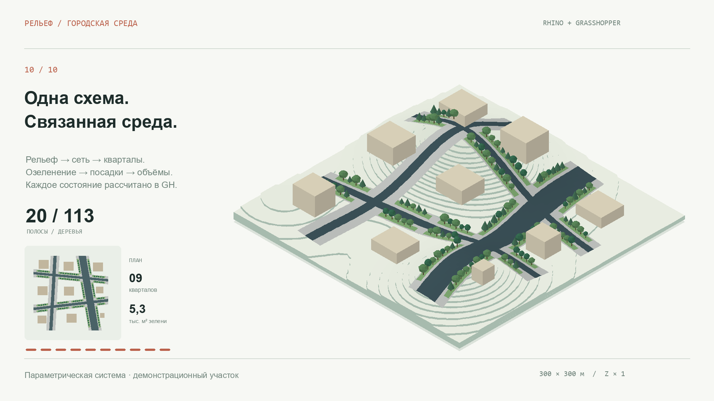

# Grasshopper files

Три небольшие учебные задачи. Для каждой разработана параметрическая схема в Rhino 8 и Grasshopper и вспомогательные скрипты на Python.

<table>
<tr>
<td width="33%" align="center"> <a href="#solar-shadows"><b>1. Инсоляция и тени</b></a></td>
<td width="33%" align="center"> <a href="#acoustic-rays"><b>2. Акустика зала</b></a></td>
<td width="33%" align="center"> <a href="#terrain-urban-system"><b>3. Рельеф и городская среда</b></a></td>
</tr>
</table>

## О репозитории

Учебная задача обычно формулируется для одного варианта исходных данных и решается один раз. Здесь каждая задача решена как параметрическая схема: при смене входных данных (город и схема застройки, положение и наклон отражателя, трасса и ширина дорог) она пересчитывается целиком. Это позволяет перебрать десятки вариантов и увидеть, как меняется результат; демонстрации (GIF и ролики) показывают именно такой перебор.

Использованные инструменты: Rhino 8 и Grasshopper для геометрии и расчёта, Python для независимого пересчёта выводов и отрисовки листов и роликов, Anemone (циклы в Grasshopper) в кейсе про акустику.

Каждый кейс лежит в своей папке: `demo/` — результаты, `definition/` — схема Grasshopper, `inputs/` — входные данные, `scripts/` — скрипты. Чтобы посмотреть результат, Rhino не нужен; он нужен, чтобы открыть и изменить схему.

| # | Кейс | Тема | Что меняется между вариантами |
|---|---|---|---|
| 1 | [Инсоляция и тени](#solar-shadows) | инсоляция расчётных точек и окон по нормам СанПиН | город (широта) и схема застройки |
| 2 | [Акустика зала](#acoustic-rays) | первые отражения звука от потолка и балкона до рядов зала | отражатели, наклон экрана |
| 3 | [Рельеф и городская среда](#terrain-urban-system) | дорожная сеть, озеленение и объёмы на рельефе | трасса, ширина дорог, зелёные полосы |

---

## 1. Инсоляция и тени

*Слева: одна схема при разных городах. Справа: разные схемы в Москве.*

**Задача.** Учебная серия задач по инсоляции: для заданного города и схемы расположения зданий определить, в какие часы расчётные точки затенены, как инсолируется детская площадка, каковы инсоляционные углы окон с лоджией и без неё и соответствует ли инсоляция нормам СанПиН для широтной зоны города. Такие задачи обычно решают графически на солнечных картах.

**Что сделано.** Схема строит лист с солнечными картами, схемами и выводами для любого сочетания «город × схема»: 10 городов от Новороссийска (44,7° с.ш.) до Ярославля (57,6° с.ш.) и 10 схем застройки. Выводы независимо пересчитывает Python-скрипт.

**Результат.** Для варианта 128 (Москва, 55,8° с.ш., норма 2 ч непрерывной инсоляции) точка у затеняющего здания затенена с 8:05 до 10:55, а во всех четырёх проверках окон непрерывная инсоляция составляет от 5 ч 52 мин до 6 ч 54 мин.

[Подробнее о кейсе →](solar-shadows/)

---

## 2. Акустика зала

*Слева: отражатели добавляются по одному. Справа: наклон экрана О3 от −16° до +10°.*

**Задача.** Учебная задача по акустике зала: показать, что в каждом ряду слушатели получают ранние отражения от потолка и балкона, которые отстают от прямого звука не более чем на 50 мс (разность хода до 17 м). Положение и наклон отражателей подбирают так, чтобы норма выполнялась для каждого ряда.

**Что сделано.** Схема строит в разрезе веера лучей от источника через шесть отражателей до 24 рядов и считает разность хода и запаздывание для каждого ряда. Отдельная анимация показывает, как меняется охват рядов при наклоне экрана О3.

**Результат.** Для зала на 24 ряда: 76 лучей, отражение получают все 24 ряда, максимальная разность хода 15,8 м, максимальное запаздывание 46 мс, норма выполняется.

[Подробнее о кейсе →](acoustic-rays/)

---

## 3. Рельеф и городская среда

**Задача.** Учебная демонстрация того, как одна параметрическая схема связывает рельеф, дорожную сеть, кварталы, озеленение и застройку: изменение трассы или ширины дороги перестраивает всё остальное. Участок тестовый, 300 × 300 м.

**Что сделано.** Дороги задаются цветными линиями, для каждого цвета своя ширина. По ним схема строит дорожную сеть и кварталы, зелёные полосы, посадки деревьев и объёмы на рельефе. Ролик на 39 с составлен из 73 состояний, каждое рассчитано в Grasshopper.

**Результат.** Финальное состояние: 20 зелёных полос, 113 деревьев, 9 кварталов, 5,3 тыс. м² зелени.

[Подробнее о кейсе →](terrain-urban-system/)
