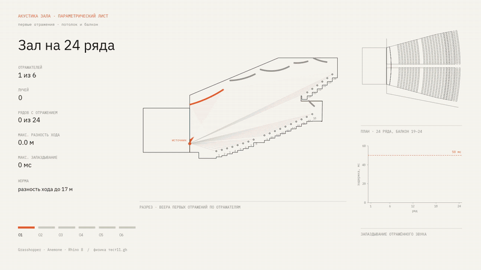
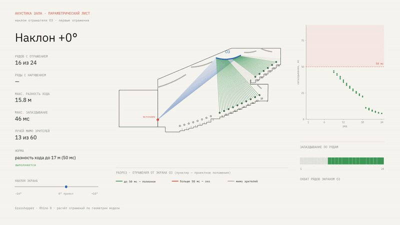

# Акустика зала

[← К списку проектов](../README.md#acoustic-rays)

Первые отражения от шести отражателей до 24 рядов зала, разность хода и запаздывание звука. Описание задачи и результат — [на главной странице](../README.md#acoustic-rays).

## Состав папки

| Путь | Содержимое |
|---|---|
| `definition/physics_test11_blocks.gh` | схема Grasshopper (последняя, упорядоченная версия) |
| `inputs/acoustics_base.3dm` | модель зала |
| `inputs/acoustics_rays.3dm` | геометрия для схемы: импортируется в модель зала |
| `demo/rays_sheet.png`, `.svg` | итоговый лист (в SVG текст остаётся текстом) |
| `demo/rays_assembly.*` | отражатели появляются по одному, 7 с (MP4, WebM, WebP, GIF) |
| `demo/screen_tilt.*` | наклон экрана О3 от −16° до +10°, 8 с (MP4, WebM, WebP, GIF) |
| `demo/screen_m16.*`, `screen_0.*`, `screen_p10.*` | стоп-кадры наклона (PNG и SVG) |
| `scripts/` | скрипты отрисовки и расчёта наклона вместе с данными `base.json`, `layout.json` |

Данные лежат рядом со скриптами: скрипты читают их относительно своей папки.

## Скрипты

| Файл | Что делает |
|---|---|
| `layout.json` | позиции блоков на листе, цвета отражателей, диапазон наклона, частота кадров |
| `base.json` | геометрия, выгруженная из Grasshopper: разрез, лучи, веера, ряды, план |
| `render.py`, `anim.py` | лист и кадры «сборки» |
| `sim2.py` | расчёт отражений при изменении экрана (мнимый источник, перекрытия балконом и потолком) |
| `anim2.py` | лист и кадры «наклона» |
| `make.py` | собирает всё в папку `out/` (имена файлов там русские, в `demo/` они переименованы) |

Пересборка: `python make.py` или по частям `python make.py stills`, `sborka`, `naklon`. Нужны Python, matplotlib, numpy, ffmpeg (libx264, libvpx-vp9, libwebp) и шрифты IBM Plex Mono и Sans; путь к шрифтам в `render.py` (`/root/fonts`) нужно заменить.

## Как получена геометрия

Открыть `inputs/acoustics_base.3dm`, сделать Import файла `inputs/acoustics_rays.3dm` (ID объектов при импорте сохраняются, ссылки схемы находят свои точки) и открыть схему. Геометрия для скриптов выгружена отдельным компонентом `EXPORT_JSON`; в сохранённую схему он не вошёл.

## Что проверено

| Проверка | Результат |
|---|---|
| Наклон 0° в `sim2.py` против схемы Grasshopper | совпадает: 16 рядов, 46 мс (по рабочим заметкам) |
| Запуск схемы из этой структуры | не выполнялся |
| Эквивалентность `physics_test11_blocks.gh` версии `тест11`, указанной на итоговом листе | не проверялась |
| Пересборка скриптов из этой папки | не проверялась |

## Известные замечания

- Анимация наклона считается в Python, не в Grasshopper. Показатели листа и анимации получены в разных условиях.
- Нормаль экрана О3 в схеме отличается от биссектрисы «падающий/отражённый луч» на 5–12°; в `sim2.py` нормали взяты из лучей схемы.
- При наклоне больше +10° экран выходит за потолок, диапазон ограничен.
- Лучей больше, чем рядов (17 на 16 рядов): ряд назначается по ближайшей точке, отклонение до 1 м.
- Считаются 223 компонента из 231; одна ошибка (Loft), 7 предупреждений; параметр Geometry без источника.
- В Custom Preview 5 материалов на 6 вееров; на листах цвета заданы в `layout.json`.
- Версия плагина Anemone и полный набор зависимостей не зафиксированы.
- Лицензия не назначена.
