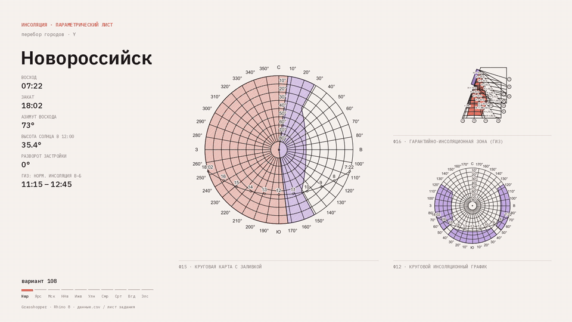
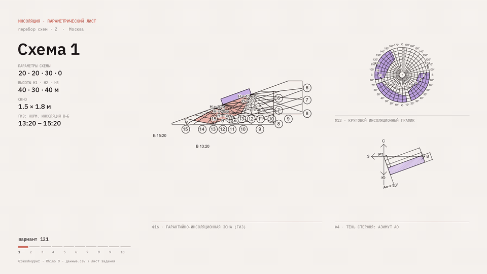

# Инсоляция и тени

[← К списку проектов](../README.md#solar-shadows)

<p>


</p>

Параметризованная серия учебных задач по инсоляции: 10 городов × 10 схем застройки, проверка по нормам СанПиН. Общее описание и результат — [на главной странице](../README.md#solar-shadows).

## Состав папки

| Путь | Содержимое |
|---|---|
| `definition/physics74_blocks.gh` | схема Grasshopper |
| `inputs/data.csv` | таблица: 10 городов (широта, восход и закат, азимуты и высоты Солнца по часам, разворот) и 10 схем (размеры, высоты зданий, окна) |
| `inputs/variants/NNN.dwg` | DWG 19 вариантов, показанных в роликах |
| `results/outputs_NNN.txt` | тексты выводов для тех же вариантов |
| `scripts/calc_outputs.py` | независимый расчёт выводов на Python (только стандартная библиотека) |
| `scripts/export_frames.cs` | экспорт кадров из Grasshopper (C# Script) |
| `demo/sheet_variant_128.png` | итоговый лист, Москва, схема 8 |
| `demo/city_sweep.*`, `demo/scheme_sweep.*` | ролики (MP4) и GIF |
| `demo/frames/` | кадры `Y_1C8` (перебор городов) и `Z_12S` (перебор схем в Москве) |

## Коды вариантов

Код `1CS`: `C` — номер города, `S` — номер схемы.

| C | Город | Широта, ° с.ш. |
|---|---|---|
| 0 | Новороссийск | 44,7 |
| 1 | Ярославль | 57,6 |
| 2 | Москва | 55,8 |
| 3 | Нижний Новгород | 56,3 |
| 4 | Ижевск | 56,8 |
| 5 | Ульяновск | 54,3 |
| 6 | Самара | 53,2 |
| 7 | Саратов | 51,5 |
| 8 | Волгоград | 48,7 |
| 9 | Элиста | 46,3 |

В репозитории 19 вариантов: `108`–`198` с шагом 10 (все города, схема 8) и `120`–`129` (Москва, все схемы).

## Что считается

Для каждого варианта по таблице `data.csv` определяется положение Солнца (азимут и высота по часам, между табличными точками интерполяция сплайном Катмулла — Рома), затем решаются задачи:

| Задачи | Что определяется |
|---|---|
| 4–5 | периоды затенения и инсоляции расчётной точки у здания 60 × 12 м |
| 6–7 | периоды инсоляции точки на детской площадке при трёх зданиях (H1, H2, H3) |
| 8–9 | инсоляционные углы окна без лоджии и с лоджией; периоды инсоляции точек РТ1 и РТ2 на фасаде и проверка нормы |
| 10 | конец и начало периода инсоляции (ГИЗ) |

Норма непрерывной инсоляции зависит от широты; из расчётного времени исключаются первые и последние часы дня:

| Зона | Норма | Исключается после восхода и перед закатом |
|---|---|---|
| севернее 58° с.ш. | 2 ч 30 мин | 1 ч 30 мин |
| 48–58° с.ш. | 2 ч | 1 ч |
| южнее 48° с.ш. | 1 ч 30 мин | 1 ч |

Норма считается выполненной, если есть непрерывный период не короче нормы либо суммарно прерывистая инсоляция не короче нормы плюс 30 мин при периоде не менее 1 ч.

## Пересчёт выводов

Из папки кейса:

```
python scripts/calc_outputs.py inputs/data.csv 128
```

Можно передать несколько кодов вариантов. Вывод совпадает с `results/outputs_128.txt`.

## Ограничения

- Здания в скрипте задаются выпуклыми многоугольниками.
- Широты городов и нормы по зонам заданы в `calc_outputs.py` (функция `norm_for` и словарь `LAT`).
- В `export_frames.cs` указан путь папки кадров; перед запуском заменить на свой.
- Геометрия для повторной отрисовки кадров в репозиторий не входит.
