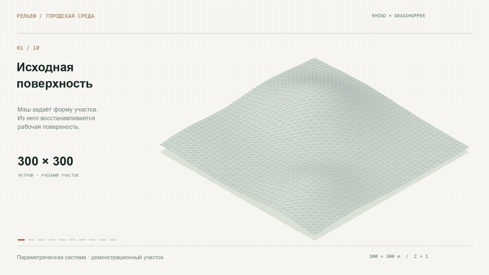

# Рельеф и городская среда

[← К списку проектов](../README.md#terrain-urban-system)

<p></p>

Демонстрационный участок 300 × 300 м. Общее описание и результат — [на главной странице](../README.md#terrain-urban-system).

## Состав папки

| Путь | Содержимое |
|---|---|
| `definition/relief_demo_v4.gh` | схема Grasshopper |
| `inputs/relief_demo_v4_inputs.3dm` | демонстрационные входы для Rhino 8: цветные оси и граница участка |
| `demo/relief_demo_v4.mp4`, `.gif` | ролик 39 с (1920 × 1080, 24 к/с) и GIF |
| `demo/relief_demo_v4_preview.gif` | облегчённое GIF-превью (800 px) |
| `demo/relief_demo_poster.png` | финальный кадр |
| `demo/relief_demo_v4_result.3dm` | статический результат базового варианта; не вход для пересчёта |
| `scripts/render_demo_v4.py`, `geometry_v4.json` | отрисовка ролика по 73 состояниям геометрии |
| `docs/controls.md` | управление схемой |

## Как открыть схему

Открыть `inputs/relief_demo_v4_inputs.3dm` в Rhino 8, затем `definition/relief_demo_v4.gh`. Считыватели цветов смотрят на активный документ Rhino; после изменения линий схему нужно пересчитать. Подробнее — в [docs/controls.md](docs/controls.md).

## Что делает схема

- Восстанавливает поверхность по мэшу и строит горизонтальные сечения с шагом 2 м.
- Читает четыре класса цветных осей, строит связную дорожную сеть и девять кварталов.
- Строит зелёные полосы вдоль дорог, обрабатывает пересечения и переносит их на поверхность.
- Расставляет посадки: делит линии на точки и подставляет три вида условных деревьев (масштаб 0,7–1,2, случайный поворот с фиксированным seed).
- Размещает тестовые объёмы в кварталах; высоту размещения на рельефе считает кластер посадки зданий.
- При изменении ширины дороги полосы и деревья отступают от её края.

## Отрисовка ролика

```
python scripts/render_demo_v4.py
```

Нужны numpy, Pillow и imageio_ffmpeg. Скрипт использует шрифты Windows (Arial, Consolas) и подключает папку `python_packages`, если она лежит рядом.

## Границы демонстрации

Данные тестовые: участок синтетический, не реальный генплан. Объёмы показывают размещение по высоте и не являются инженерным проектом фундаментов; результат не предназначен для раскладки деталей под лазерную резку. Слоистая подложка в схеме — сохранённый мэш текущего участка: при замене рельефа его нужно обновить.
