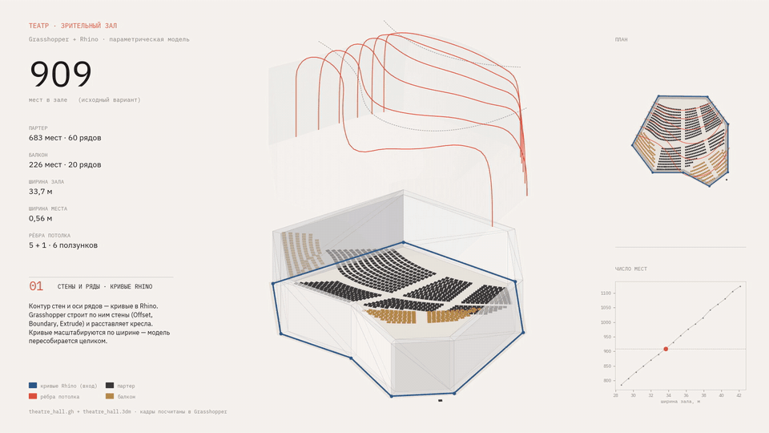
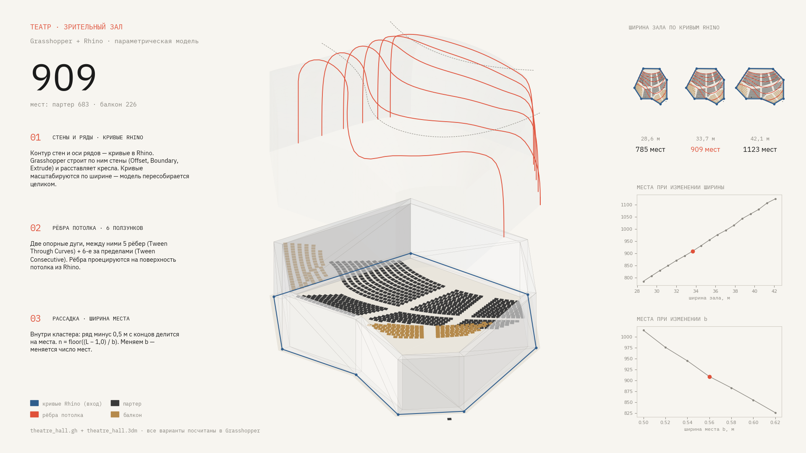
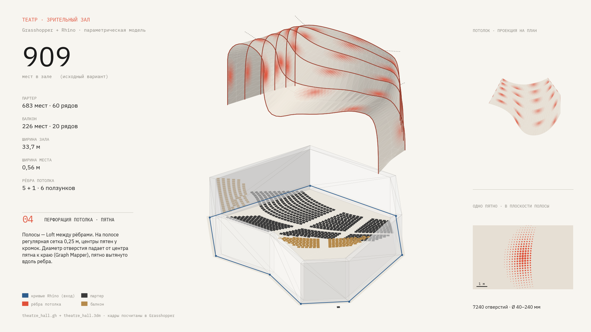

# Зрительный зал драматического театра

[← К списку проектов](../README.md#theatre-hall)

> **Это часть курсового проекта, а не самостоятельный проект.** Небольшая параметрическая задача выполнена в рамках курсового архитектурного проекта «Драматический театр»: модель зрительного зала и его потолка в Rhino 8 и Grasshopper.

<p></p>

Схема строит по кривым Rhino стены и рассадку зала на 909 мест (партер 683, балкон 226), рёбра потолка и перфорацию потолка. Общее описание и результат — [на главной странице](../README.md#theatre-hall). Ролик на 22 с (`demo/theatre_parametric.mp4`) составлен из состояний, каждое из которых рассчитано в Grasshopper.

## Состав папки

| Путь | Содержимое |
|---|---|
| `definition/theatre_hall_blocks.gh` | основная схема: зал, рассадка, рёбра потолка |
| `definition/theatre_perforation_spots.gh` | перфорация потолка: полосы между рёбрами, пятна отверстий |
| `inputs/theatre_hall.3dm` | модель Rhino: 199 объектов, на которые ссылаются схемы (кривые, поверхности, потолок SubD), с исходными идентификаторами |
| `demo/theatre_sheet.png`, `.svg` | лист по главам 1–3 (в SVG текст остаётся текстом) |
| `demo/theatre_perforation.png`, `.svg` | лист по главе 4 |
| `demo/theatre_parametric.*` | ролик 22 с (MP4, WebM); `theatre_preview.gif` — облегчённая версия для этой страницы |
| `demo/layers/` | аксонометрия и план для пяти состояний: прозрачные PNG и SVG |
| `scripts/` | отрисовка листов, кадров и слоёв; рядом данные: `states/` (геометрия 43 состояний из Grasshopper), `perf/` (отверстия по полосам), `theatre_states.json` (список состояний прогона) |
| `rhino/` | скрипты, которые работают только внутри Rhino и Grasshopper |
| `docs/definition.md` | устройство схемы: зависимости, ползунки, расчёт мест, алгоритм перфорации |
| `fonts/` | IBM Plex Mono и Sans для отрисовки, лицензия SIL OFL |

## Что считается

1. **Стены и ряды от кривых Rhino.** Контур зала (8 отрезков) и оси рядов задаются кривыми в Rhino. Схема строит стены (Join → Offset → Boundary → Extrude, высоты 8 и 12 м) и расставляет кресла. Кривые масштабируются по ширине вокруг оси зала x = −3,132 м с коэффициентом 0,85…1,25: ширина зала 28,6 → 42,1 м, мест 785 → 1123.
2. **Рёбра потолка.** Две опорные дуги, между ними 5 рёбер (Tween Through Curves, 5 ползунков 0…1) и шестое за пределами дуг (Tween Consecutive, ползунок 0…2). Рёбра проецируются на поверхность потолка SubD. Ролик показывает ползунки в трёх режимах: равномерно, сгущение к сцене, сгущение к дальней дуге.
3. **Рассадка.** Ряд обрезается на 0,5 м с каждого конца, число мест n = floor((L − 1,0) / b), где b — ширина места. Пример: ряд L = 8,79 м, b = 0,56 м → (8,79 − 1,0) / 0,56 = 13,9 → 13 мест. При b от 0,50 до 0,62 м мест 1015 … 826 (исходно b = 0,56 м, 909 мест).
4. **Перфорация потолка.** Рёбра дают полосы (Loft соседних рёбер). На выбранной полосе строится регулярная сетка 0,25 м, центры пятен попеременно у кромок; диаметр отверстия убывает от центра пятна к краю (Remap → Graph Mapper), пятно вытянуто вдоль ребра. Итог по пяти полосам: 7240 отверстий диаметром 40–240 мм.

| Ширина зала, м | Мест | | Ширина места b, м | Мест |
|---|---|---|---|---|
| 28,6 (×0,85) | 785 | | 0,50 | 1015 |
| 33,7 (×1,0) | 909 | | 0,56 | 909 |
| 42,1 (×1,25) | 1123 | | 0,62 | 826 |

<p></p>

<p></p>

Подробнее об устройстве схемы — [docs/definition.md](docs/definition.md).

## Как открыть схему

Нужны Rhino 8 и Grasshopper. Открыть `inputs/theatre_hall.3dm`, затем схему из `definition/`: она читает геометрию из модели по идентификаторам объектов. Модель сокращена до объектов, нужных схемам; остальное содержимое полной модели зала (текстуры, материалы, прочие объекты) в неё не входит. Результаты (`demo/`) и скрипты отрисовки от Rhino не зависят.

## Скрипты

Скрипты запускаются из папки `scripts/` и читают данные относительно себя. Нужны Python 3, numpy, matplotlib; шрифты берутся из `fonts/`.

| Файл | Что делает | Запуск |
|---|---|---|
| `render.py` | общая отрисовка: изометрия, стены, кресла, рёбра, план | модуль |
| `frame.py` | кадр 1920×1080 для глав 1–3 | `python frame.py u00 1 кадр.png walls` |
| `sheet.py` | лист глав 1–3, PNG и SVG | `python sheet.py ../demo/theatre_sheet` |
| `perforation.py` | кадр и лист главы 4 | `python perforation.py кадр.png 1.0` |
| `layers.py` | слои (аксонометрия и план) для пяти состояний | `python layers.py ../demo/layers` |
| `anim.py` | последовательность кадров всех четырёх глав | `python anim.py ../out/frames` |
| `../rhino/probe_driver.py` | код для компонента Python 3 Script внутри Grasshopper: по очереди применяет состояния из `theatre_states.json` и записывает геометрию каждого в `theatre_st_<tag>.json` | только в Rhino |
| `../rhino/scale_curves.py` | масштабирование кривых зала по X внутри Rhino | только в Rhino |

Папка для обмена данными в скриптах Rhino задаётся переменной окружения `THEATRE_DIR` (по умолчанию `C:\temp\theatre`).

Ролик собирается из кадров `anim.py` командами ffmpeg:

```
ffmpeg -framerate 25 -i ../out/frames/f%04d.png -c:v libx264 -pix_fmt yuv420p -crf 18 -preset slow theatre_parametric.mp4
ffmpeg -framerate 25 -i ../out/frames/f%04d.png -c:v libvpx-vp9 -b:v 0 -crf 32 -row-mt 1 theatre_parametric.webm
```

## Ограничения

- Перфорация в `theatre_perforation_spots.gh` берёт рёбра как внутренние данные, скопированные из схемы зала, а не проводом. Чтобы связать схемы, блок перфорации копируют в `theatre_hall_blocks.gh` или делают кластер с входом по одному ребру.
- Полосы перфорации считаются по одной (ползунок «полоса №», 30–50 с на полосу): все пять сразу подавать нельзя, Rhino зависает.
- Анимация главы 4 — поочерёдное появление готового результата, а не изменение параметра. В главах 1–3 каждый кадр — отдельный пересчёт Grasshopper.
- В масштабировании и в демонстрации не участвуют порталы, ограждения балкона и объёмы Sweep.
- Потолок в модели расположен на отметках 20–37 м, стены — 8 и 12 м, поэтому на аксонометрии потолок выглядит «разнесённым».
- Один ряд балкона даёт кресло за контуром стен (справа снизу на плане): это результат схемы, он не правился.
